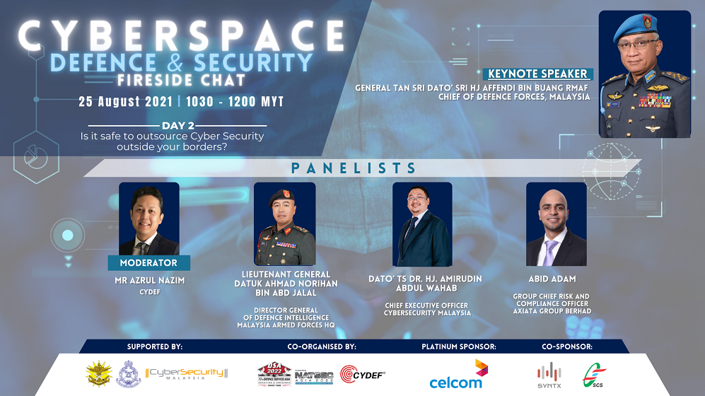

# 25 August 2021

Part 2 of the webinar organized by Cybersecurity Malaysia, I believe.

The title feels like it has an obvious answer 'no' so hopefully there are some interesting points I can learn about.

One of the speakers mentioned that outsourcing is used often which is surprising.

No silver bullet or yes or no according to Mr Abid Adam. However, governannce and decision making should never be outsourced (and possibly other more critical factors in an organization). This is due to 3rd parties not having the full context of what I assume is the organization. Makes sense.

Axiata used a ratio of in-source:out-sourcing of something like 70:30 for some of their departments. But their SOC is 100% run in-source. 

One of the speaker added in, When outsourcing is used, close cooperation is extremely important. Having an SLA and abiding by it is extremely important. A balance of cost versus security guarantees needs to be considered.

I wish I can see exactly who is talking at a time but one of the speakers confirmed that the Malaysian military use a combination of in and outsourcing which is cool.

Take adaptive security measures - don't just be reactive. Means, I should look into blue teams more too.

Malaysia has sporadic laws for cybersecurity and should move to legislating specific laws against it.

Malaysia is 5th in some cybersecurity index, huh.

Overall, the talk had some interesting things and brought some of doubts to light regarding how the military handles cybersecurity.