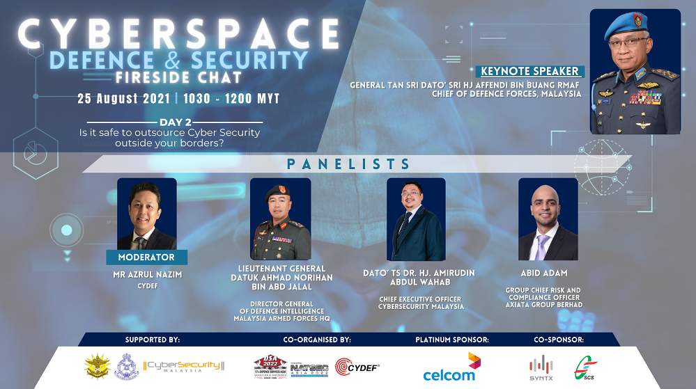

# 24 August 2021

This is not directly related to Tryhackme but is info sec related. 

Joined late because I clicked the wrong link but I think I get the main gist of this webinar. The main focus is on Ransomware and how it affects industries and how to counteract it. As someone without much professional experience in any industry, it did not really occur to me how big ransomware is.

One of the speaker mentioned that plenty of companies have paid up for ransomwares anyways especially if the data in ransom is particularly valuable and this is mostly an open secret type of thing. I naively thought that this either do not occur that much, or the latest security technology is getting better at preventing this. 

The speaker Mr Cartan from Nihon Cyber Defence Japan mentions one of the weakest links for any government agencies/industry is the overseas office (will need to re-check the exact term used so I hope this conveys the meaning well enough). Due ot this weakest links, these ransomware attacks have evolved to be more sophisticated to abuse every weakest exploit. In other words, the attackers had enumerated their targets well.

Through their enumeration, they even manage to identify and call out bluffs by companies that claim to not be able to pay a ransomware by pointing out insurance the company may have. 

What I got from this webinar is that I am not sure exactly what to do if a ransomware attack does happen. However, considering that Windows is the most used OS, it probably involves securing Windows and as far as I know, Microsoft does have services for ransomware attacks with Onedrive.

Another way to mitigate these attacks is probably to use a hardened version of a Linux-based OS. Either way, should definitely look into these attacks more especially from a defensive perspective.