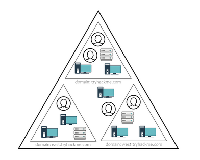
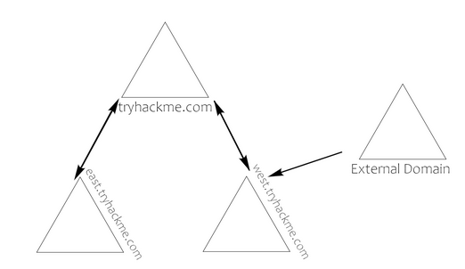
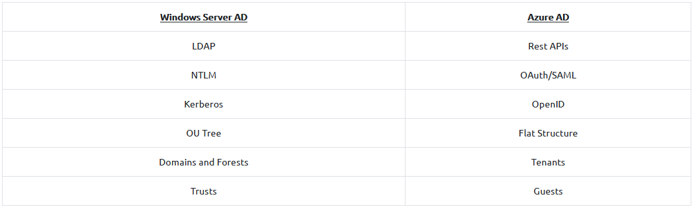

# Tryhackme 31 July 2021
## Active Directory Basics
Decided to improve formatting and add images as a test for this entry.

AD DS: Active Directory Data store

NTDS.dit: stores Active Directory details. specifially, database of the active directory domain controllers and password hashes of the domain users.

Stored at %SystemRoot%\NTDS

Unfamiliar terms:

> Domain Controllers

A Windows server that is a domain controller in a forest

> Forest

A term for a collection of domains

> Users and Groups

Too many to care to elaborate

>Trust

1. A mechanism to determine how users can gain access to resources within a domain
1. Generally outlines how domains in a forest communicate with each other   
1. Can be extended to external domains and forests

> Domain Trusts + Policy

1. Directional: trust direction involving a trusted and trusting domain
1. Transitive: more than two domains to include other/external trusted domains

> Domain Policies

Set of rules to apply to a domain as a whole instead of just users

> LDAP

Lightweight Directory Access protocol: enable communication between applications and directory services

>DNS, LLMNR, NBT-NS 

Domain Name Services for identifying IP hostnames

> Certicate services

Enables domain controllers to add, revoke and validate public key certificates.

> Authentication

General point for exploitations by pentesters. NLTM & Kerberos is exploited often.

> Active Directory in Cloud

Azure Active Directory is a middlemen -> enhances security

Above compares difference between locally hosted AD vs Azure's implementation.

# Tryhackme 1 August 2021
## Active Directory Lab
### To avoid cluttering the directory, similar labs will be in one even if dates are different

https://gist.github.com/HarmJ0y/184f9822b195c52dd50c379ed3117993

> powershell -ep bypass

Lets user starts ps with execution policy bypassed

> . .\PowerView.ps1 

Imports PowerView module

>Get-NetComputer -fulldata | select operatingsystem

 self explanatory

>Get-NetUser | select cn

Get users in the domain3

>Get-NetUser -SPN | ?{$_.memberof -match 'Domain Admins'}

Check details of a user. Used here to check when password was last set. Very particular with the spaces

>Get-NetGroup -GroupName *

Get list of groups in the domain