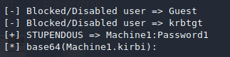
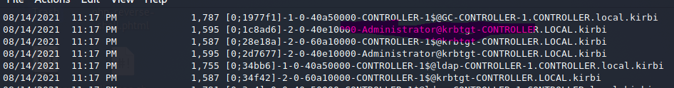
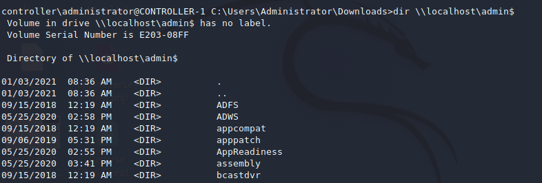

# Tryhackme 8 August 2021
## Attacking Kerberos

>What does TGT stand for?

Ticket granting ticket
>What does SPN stand for?

Service principal name

>What does PAC stand for?

Privilege attribute certificate

>AS-REQ w/ Pre-Authentication In Detail

AS: Authentication service; to issue TGTs

1. AS-REQ begins in Kerberos authentication when a TGT is requested by user to the KDC.
1. To validate and provide TGT to user, KDC must follow specific steps
1. User encrypts a timestamp NT hash.
1. Hash sent to the AS
1. KDC decrypts the timestamp using the NT hash received from user.
1. If successful, TGT granted and a session key for the user.

>Ticket Granting Ticket Contents


From Tryhackme Attacking Kerberos room

1. TGT is provided by the user to the KDC. (Remember, a user first has to obtain a TGT from KDC)
1. KDC validates the TGT and returns a service ticket (TGS)

>Service Ticket Contents 

Contains two portions:
1. Service portion: user details, session key, encrypts tickets with service account NTLM hash
1. User-portion: validity timestamp, session key, encrypts with TGT session key

>What two services make up the KDC?

AS, TGS

>Kerberos Authentication Diagram


1. AS-REQ: user requests for TGT
1. AS-REQ: KDC verifies client and sends back an *encrypted* TGT
1. TGS-REQ: The encrypted TGT is sent to TGS *with* the Service Principal Name (SPN) of the service the client wants to access
1. TGS-REQ: KDC verifies TGT of the user and also if the user has access to the service. A valid session key for the service is then sent.
1. AP-REQ: Client requests for the service and sends the session key to prove it has access to it.
1. AP-REQ: Server performs authentication and access granted.

>Kerberos Ticket Overview

1. The TGT will usually be in a .kirbi format for Rubeus or .ccache for Impacket. The tickets are usually encoded in base64 (which probably explained why the file containing a domain name and passwword was encoded in base64(?)).
1. TGT is only used with KDC to get service tickets (TGS)
1. Once a TGT is provided, the server should reply with User details, Session key, and encrypts the service ticket with the service account NTLM hash.
1. TGT provides the encrypted timestamp, session key, and the encrypted TGT.
1. KDC authenticates the TGT and provides the service ticket based on the service requested.
1. Typically, the provided TGT would only work with the assosciated service.
1. A KRBTGT instead can allow attacker to gain any service access which allows any access to anything in the domain.

## Tryhackme  9 August 2021
### Enumerating Kerberos

As I already have Kerbrute installed from a previous room attempt, I am not gonna bother detailing how to install it. However, I will note that the IP address of the machine need to be added into the /etc/hosts file or Kerbrute will not work. Not sure how I managed to finished the previous room while not remembering about this tidbit. Maybe I used the IP address instead of a variable? Will need to revisit that at some point.

>How many total users do we enumerate?

10

>What is the SQL service account name?

sqlservice

>What is the second "machine" account name?

machine2

>What is the third "user" account name?

user3

### Harvesting & Brute-Forcing Tickets w/ Rubeus 

This section requires the use of a tool called Rubeus. The tool seems to be very powerful to attack Active Directories with the slew of features it has.

As a first impression, to use this, it seems Rubeus must be installed on the target machine because it is pre-installed with the target machine that I ssh'd into.

### Harvesting Tickets w/ Rubeus 

'Harvesting' is a process that gathers the tickets that are being transferred to the KDC and saves them. Afterwards, it can  be used for attacks like pass the ticket apparently.

>Rubeus.exe harvest /interval:30

A command to harvest tickets every 30 seconds.

### Brute-Forcing / Password-Spraying w/ Rubeus 

Brute-forcing should be familiar to most people and myself but Password Spraying is a new concept for me so I will be describing it in a way I can understand.

>Password spraying

Simply means take 1 password and try it against all known usernames to see which ones use that password.

Before password spraying wiwth Rubeus, the CONTROLLER.local (could be anything I'm pretty sure, treating it as a variable name) must be set to the machine IP address.

>echo 10.10.147.2 CONTROLLER.local >> C:\Windows\System32\drivers\etc\hosts

This command is executed. Should be self explanatory.

>Rubeus.exe brute /password:Password1 /noticket

Afterwards, this command is executed. The password is provided and sprayed against all found users. Afterwards, a .kirbi TGT is given for the found user.



### Kerberoasting w/ Rubeus & Impacket

### A refresher on Kerberoasting

On a previous room, I learned the gist of Kerberoasting from other walkthroughs. This room does describe Kerberoasting in more detail. 

1. Generally, Kerberoasting allows a user to request a service ticket for any service *WITH* a registered SPN.
1. The ticket is then used to crack the service password.
1. For a service to be Kerberoastable, it needs to have a registered SPN.
1. Success depends on password strength and if it is trackable (not sure what that means, speculation: whether the account can be discovered in the enumeration stage, maybe. Will edit this out when I find out.)
1. The success also depends on the privilege of the cracked account.
1. A tool like Bloodhound can be used to find Kerberoastable account.

### Rubeus (meh) and Impacket cracking

In this section, Rubeus will be used to perform the Kerberoasting.

To begin, after I ssh into the target machine (username and password is provided), cd into Downloads. A Rubeus executable file will be there.

>Rubeus.exe kerberoast

This command is executed to dump the Kerberos hash of any Kerberoastable user.

The result of thee dump shows two Kerberoastable users. The hashes from each account is stored within a .txt file in my Kali machine. With the hash obtained, hashcat is run to crack it. A modified wordlist is provided to speed up the cracking time.

The hashcat mod to be used here is as below:
>13100 | Kerberos 5, etype 23, TGS-REP                    | Network Protocols

TGS is reeferring to the ticket granting service. At the moment, I am a bit unclear as to why this one is chosen specifically. I am guessing Rubeus dumped the TGS content. Will find better sources to explain this step now.

>hashcat -m 13100 -a 0 hashcat.txt Pass.txt --force

The command used to crack the password. Formatting the file output from Rubeus took way more effort than needed because I could not copy paste the hash output in a format that hashcat accepts. Not sure if there's an easier way, but I used vim to remove all whitespaces and newlines. I want to say it was a waste of timee but at least I understand howw powerful vim can be now.

--force is used because hashcat does not seem to like to be run in a virtual machine.


>What is the SQLService Password?

MYPassword123#

>What is the HTTPService Password?

Summer 2020

I am not kidding when I said getting the above password took me hours. For whatever reason, I am not sure whether it was due to me not formatting the hash properly or what, using the Rubeus method to get the hash and cracking it had issues. There was no problem cracking the SQLService password though.

The issue started with this error:

```
ATTENTION! Pure (unoptimized) backend kernels selected.
Using pure kernels enables cracking longer passwords but for the price of drastically reduced performance.                                                                                      
If you want to switch to optimized backend kernels, append -O to your commandline.
See the above message to find out about the exact limits.
```

using --force did not help as well as the -O that was suggested. There was also a mention of this error:

```
The wordlist or mask that you are using is too small.
This means that hashcat cannot use the full parallel power of your device(s).
Unless you supply more work, your cracking speed will drop.
For tips on supplying more work, see: https://hashcat.net/faq/morework
```

I tried referring to the link it provided but it did not help.

For Kerberoasting, Tryhackme mentioned an alternative to Rubeus which is to use Impacket so I did exactly that. I recall that The Cyber Mentor really likes Impacket and I understand why now because cracking the hash that Impacket provided was significantly easier.

Since this cracking is done remotely on my own machine - instead of running Rubeus.exe which exists on the target machine - I can simply copy paste the hash that was dumped and begin cracking it. Previously, since Rubeus is executed on the victim machine, copy pasting anything from there caused formatting issue which might have contributed to the failure of cracking the HTTPS service password.

### What does a service account do?

1. If service iacount is a domain admin, it is possible to dump the NTDS.dit (it's like getting a golden/silver ticket)
1. If not a domain admin, there's potential to log in to other accounts and escalate privilege from there.
1. Or, use a password spray technique with any cracked passwords against other service/domain admin accounts because some administrators may reuse passwords.

### Countering Kerberos

1. Use strong service passwords and don't reuse passwords => password sprays are less effective
1.  Avoid setting Service accounts as Domain Admins. This avoids the golden ticket scenario that can lead to an NTDS.dit dump.

Conclusion:

Just use Impacket whenever possible for Kerberoasting.

## Tryhackme 15 August 2021

### AS-REP Roasting with Rubeus

Since I did AS-REP roasting previously, I will write again that this method only applies to accounts with pre-authentication disabled. Meaning, the account does not need to be authorized to get a TGT.

My notes from a previous room:

```
>ASREPRoasting

An attack method to abuse an account that has a the privilege "Does not require Pre-authentication" so it can request tickets easily. However, the user account with that privilege set needs to be identified.

This method is used by skipping the TGT process that would have been executed in a Kerberoasting sequence
```

I already have my dislike for Rubeus but the command for AS-REP roasting is simply

>Rubeus.exe asreproast

which dumps vulnerable users to AS-REP roasting. 

I figured out a way to use Rubeus without pulling my hair out. After copying the hash that Rubeus dumped, paste it into Notepad and delete the newlines manually. It doesn't take that long. Trying to use vim to remove it sometimes work sometimes it doesn't. Probably because I'm just bad at vim but if doing a simpler step gets the job done why use some special method.

Anyways, here are the answers for the room.

>Which User is vulnerable to AS-REP Roasting?

user3

>What is the User's Password?

Password3

>Which Admin is vulnerable to AS-REP Roasting?

Admin2

>What is the Admin's Password?

P@$$W0rd2

> What hash type does AS-REP Roasting use? 

Kerberos 5, etype 23, AS-REP

You can get the above answer with hashcat -h and find the hash mod 18200.

### Pass the Ticket w/ mimikatz

This section uses mimikatz but if I recall correctly it's now called Kiwi. Regardless, the target machine does have Kiwi installed.

>LSASS memory

The notes on THM mentions this but I am unsure of what this means. Further research shows it is a "Local Security Authority Subsystem Service".

Essentially, it is a very valuable system that contains a lot of sensitive data like encrypted passwords, NT hashes, LM hashes and Kerberos tickets. This system is generated upon login if I understood correctly and contains a bunch of credentials so makes sense why hacking this is valuable.

Source referred to: https://redcanary.com/threat-detection-report/techniques/lsass-memory/

Probably the most interesting thing about that article is a powershell command being executed in reverse set to a variable N1. If I recall this is a method of obfuscation. A past attempt I've seen from a CTF competition past questions I tried solving had a method where it inserts certain characters between every few words.

Apparently THM also elaborated on the LSASS so I'll do my best to summarize it mostly for myself.

1. Pass the ticket works by dumping the TGT from the LSASS memoryu.
1. As mentioned previously, LSASS contains a bunch of information that can be used in an exploit including Kerberos tickets etc
1. Like dumping hashes from previous practicals, the tickets can also be dumped.
1. Dumping tickets with mimikat gives a .kirbi file which to recall, are TGT in a certain format. The other format being .ccache. Can just CTRL+F .kirbi and check the previous entry.
1. This .kirbi ticket can be used to get a domain admin account if a domain admin ticket exists in the LSASS memory.
1. This allows privilege escalation tactics or lateral movements if other unsecured accounts are found.
1. Escalation to domain admin is possible by dumping domain admin tickets and then impersonate as them using a mimikatz Pass the Ticket attacks.
1. Pass the ticket allows reusing a ticket to gain access with a hopefully privileged account.


### Using mimikatz

>mimikatz.exe

Self-explanatory

>privilege:;debug

```
mimikatz # privilege::debug 
Privilege '20' OK 
```

Means I can use mimikatz on the machine with admin privilege

>sekurlsa::tickets /export

Exports .kirbi tickets 

In this practical, I will use the Administrator@krbtgt ticket. Excuse the poor highlights.



Selecting that ticket should allow me to impersonate as the account displayed and Pass the Ticket.


### Actually passing the ticket

With mimikatz.exe executed, enter this command

>mimikatz # kerberos::ptt [0;1c8ad6]-2-0-40e10000-Administrator@krbtgt-CONTROLLER.LOCAL.kirbi 

The ticket I use is the one highlighted in the previous image. This comand caches and impersonates with the given ticket.

At this point, mimikatz will no longer be used but 
>klist 

is executed to verrify that the impersonation is succeessful.

``` ps1
controller\administrator@CONTROLLER-1 C:\Users\Administrator\Downloads>klist

Current LogonId is 0:0x3f14aa

Cached Tickets: (1)

#0>     Client: Administrator @ CONTROLLER.LOCAL
        Server: krbtgt/CONTROLLER.LOCAL @ CONTROLLER.LOCAL
        KerbTicket Encryption Type: AES-256-CTS-HMAC-SHA1-96
        Ticket Flags 0x40e10000 -> forwardable renewable initial pre_authent name_canonicalize
        Start Time: 8/14/2021 21:09:50 (local)
        End Time:   8/15/2021 7:09:50 (local)
        Renew Time: 8/21/2021 21:09:50 (local)
        Session Key Type: AES-256-CTS-HMAC-SHA1-96
        Cache Flags: 0x1 -> PRIMARY
        Kdc Called:

controller\administrator@CONTROLLER-1 C:\Users\Administrator\Downloads>
```

We can see that it prints the Administrator@CONTROLLER.LOCAL which should mean it is a success. 

With the above steps, THM highlights this is simply a proof-of-concept and that actually trying to PTT will be very different. It is worth mentioning the account I was originally provided is already a domain admin if I'm not mistaken (I've been working on this room for almost a week due to lack of free time and how much content needed to go through so I may have forgotten some details.)

Another way to verify the account is to look for the admin share.

THM provided their own method with giving an actual IP address but when I tried it, it did not work probably becasue my machine IP is different. Instead I used

>dir \\localhost\admin$ 

which seems to work.



### Pass the ticket mitigation

For a blue team perspective, apparently the best practice is to  ensure domain admins DO NOT log into anything other than the domain controllers.

Remembering how LSASS work, this makes sense. If domain admin account logs into any computer, their credentials will be stored at the LSASS which leaves it vulenrable for these exploits.

### Golden/Silver Ticket Attacks with mimikatz

This room will focus on Silver tickets. Why?

Apparently, getting Silver tickets is more discreet therefore less detectable. I assume this will be useful for red teaming because blue teams will have a more difficult time to tracing any attacks that happen.
 
Silver tickets are limited to the service that is targeted whereas gold tickets allow access to any Kerberos service.

### KRBTGT vs TGT

1. A KRBTGT is the service account for the KDC.
1. KDC issues tickets to clients.
1. Impersonating a KRBTGT by creating a golden ticket gives the ability to create service tickets for any account. 
1. TGT is a ticket to a service account issued by the KDC.
1. TGT can only access the service it was created for.

### Golden/Silver Ticket Attacks Overview

1. Golden tickets attacks dumps TGT of any user in the domain where preferably they are a domain admin and the KRBTGT ticket is dumped.
1. Silver tickets instead, any servie or domain ticket is dumped.
1. As a result of above, the service/domain admin account's SID/identifier AND the NTLM hash is provided.
1. The details can then be used inside a mimikatz golden ticket attack.
1. A TGT is created that impersonates the given service acount information.

### Dumping the KRBTGT hash

After checking privilege and running mimikatz.exe, the command below is executed

>lsadump::lsa /inject /name:krbtgt

We can see that the commpand begins an lsadump (lsa here being the LSASS memory)

An article I came across which might be good reading https://blog.3or.de/mimikatz-deep-dive-on-lsadumplsa-patch-and-inject.html


<details>
<summary>Dump result</summary>

``` ps1
mimikatz # lsadump::lsa /inject /name:krbtgt 
Domain : CONTROLLER / S-1-5-21-432953485-3795405108-1502158860 

RID  : 000001f6 (502)
User : krbtgt

 * Primary
    NTLM : 72cd714611b64cd4d5550cd2759db3f6
    LM   :
  Hash NTLM: 72cd714611b64cd4d5550cd2759db3f6
    ntlm- 0: 72cd714611b64cd4d5550cd2759db3f6
    lm  - 0: aec7e106ddd23b3928f7b530f60df4b6

 * WDigest
    01  d2e9aa3caa4509c3f11521c70539e4ad
    02  c9a868fc195308b03d72daa4a5a4ee47
    03  171e066e448391c934d0681986f09ff4
    04  d2e9aa3caa4509c3f11521c70539e4ad 
    05  c9a868fc195308b03d72daa4a5a4ee47
    06  41903264777c4392345816b7ecbf0885
    07  d2e9aa3caa4509c3f11521c70539e4ad
    08  9a01474aa116953e6db452bb5cd7dc49
    09  a8e9a6a41c9a6bf658094206b51a4ead
    10  8720ff9de506f647ad30f6967b8fe61e
    11  841061e45fdc428e3f10f69ec46a9c6d
    12  a8e9a6a41c9a6bf658094206b51a4ead
    13  89d0db1c4f5d63ef4bacca5369f79a55
    14  841061e45fdc428e3f10f69ec46a9c6d
    15  a02ffdef87fc2a3969554c3f5465042a 
    16  4ce3ef8eb619a101919eee6cc0f22060
    17  a7c3387ac2f0d6c6a37ee34aecf8e47e
    18  085f371533fc3860fdbf0c44148ae730
    19  265525114c2c3581340ddb00e018683b
    20  f5708f35889eee51a5fa0fb4ef337a9b
    21  bffaf3c4eba18fd4c845965b64fca8e2
    22  bffaf3c4eba18fd4c845965b64fca8e2
    23  3c10f0ae74f162c4b81bf2a463a344aa
    24  96141c5119871bfb2a29c7ea7f0facef
    25  f9e06fa832311bd00a07323980819074 
    26  99d1dd6629056af22d1aea639398825b
    27  919f61b2c84eb1ff8d49ddc7871ab9e0
    28  d5c266414ac9496e0e66ddcac2cbcc3b
    29  aae5e850f950ef83a371abda478e05db

 * Kerberos
    Default Salt : CONTROLLER.LOCALkrbtgt
    Credentials
      des_cbc_md5       : 79bf07137a8a6b8f

 * Kerberos-Newer-Keys
    Default Salt : CONTROLLER.LOCALkrbtgt
    Default Iterations : 4096
    Credentials
      aes256_hmac       (4096) : dfb518984a8965ca7504d6d5fb1cbab56d444c58ddff6c193b64fe6b6acf1033 
      aes128_hmac       (4096) : 88cc87377b02a885b84fe7050f336d9b
      des_cbc_md5       (4096) : 79bf07137a8a6b8f

 * NTLM-Strong-NTOWF
    Random Value : 4b9102d709aada4d56a27b6c3cd14223
```
</details>

### Creating a Golden Ticket

>mimikatz # Kerberos::golden /user:Adminstrator /domain:controller.local/sid:S-1-5-21-432953485-3795405108-1502158860 /krb
tgt:72cd714611b64cd4d5550cd2759db3f6 /id:502

Above is the command I used for test number 1. The THM guide used /id:500 which is apparently the default RID for Admin accounts. I used 502 instead as a test and a ticket is generated no problem. As of writing this, I have not attempted to use the ticket. This is for documenting my mistakes to learn from it. But the values are as follow:

sid: obtained from the lsadump above.
Domain : CONTROLLER / S-1-5-21-432953485-3795405108-1502158860

krbtgt: obtain from lsadump above too/
Primary NTLM : 72cd714611b64cd4d5550cd2759db3f6

### Using the tickets (attempt #1)

```ps1
mimikatz # misc::cmd
Patch OK for 'cmd.exe' from 'DisableCMD' to 'KiwiAndCMD' @ 00007FF7C4C343B8 
```

Opens an elevated cmd prompt with the given ticket in mimikatz.

Does not look like I can access another user with the ticket I generated.

After attempting again, I realize this is not possible because there are no other users connected to the domain so whoops. Now I get what the author meant.

>What is the SQLService NTLM Hash?

To obtain this, run the lsadump for the sqlservice user. (I totally forgot this user existed until I checked back other writeups. Not a good idea to do this room with days between sections.)

Run the command below:
mimikatz # lsadump::lsa /inject /name:sqlservice 

c*a

>What is the Administrator NTLM Hash?

Run the command below:
mimikatz # lsadump::lsa /inject /name:Administrator 

2*6


### Kerberos Backdoors with mimikatz

1. This backdoor utilizes a skeleton key. This key is similar to a rootkit whereby it implants itself into the memory of the domain forest. Like rootkits, it then grants access to any machines with a master password
1. Skeleton keys abuse the way AS-REQ validates encrypted timestamps and only works with Kerberos RC4 encryption.
1. Default hash for mimikatz skeleton results in the password 'mimikatz'.
1. A timestamp is encrypted with a user's NT hash.
1. A domain controller tries to decrypt this timestamp with the user's NT hash.
1. If a skeleton key is implanted, the domain controller attempts to decrypt the timestamp using the user NT hash AND the skeleton key NT hash thus granting access to the domain forest.

### Preparing mimikatz for backdoor

Always run

>privilege::debug

to ensure you have admin access.

### Install the skeleton key

>misc::skeleton

Very anticlimatic but sure.

``` ps1
mimikatz # misc::skeleton 
[KDC] data 
[KDC] struct
[KDC] keys patch OK
[RC4] functions
[RC4] init patch OK
[RC4] decrypt patch OK
```
### Accessing the forest

Supposedly, I should be able to access any machine now with providing mimikatz as the password. 

Interesting to note that this access does not persist because it only runs in memory. Other scripts can be used to have persistent access. But if there scripts being used, a blue team would probably be able to detect it.

### Conclusion

Use Impacket when possible and I should try to setup my own lab to try more advanced Kerberos attacks. This room also ended up being the most difficult to go through in my opinion. The only other topic that came close to pushing me this much is privilege escalation with PATH manipulation.


